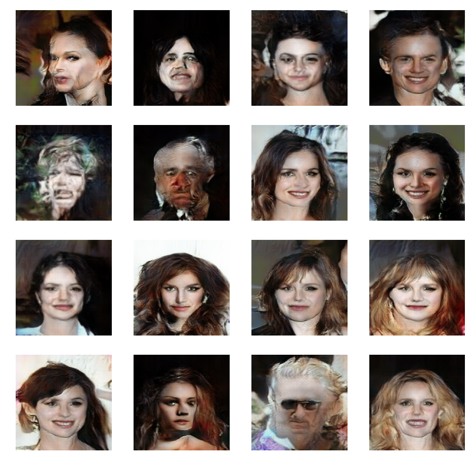

# DCGAN-tensorflow

This is a simple DCGAN implementation of https://arxiv.org/pdf/1511.06434.pdf for generating new unseen images within the same domain as the dataset (in 64x64 resolution).
The model was trained for 10 epochs using a celeb-hq dataset containing 200k face examples, which means that model was feeded with 2mln examples. In practice it was giving satisfactory results even with dataset containing 5k celeb images, but generated images was noticeably lower quality (model was starting to overfit after several epochs)

## Results

### 64x4 images

Generated images as a gif for 16 fixed noises, through the 10 epochs of training.

Samples for last (10th) epoch:

Discriminator and generator losses:

### 128x128 images

I also tried with higher resolutions, by simply adding additional convolutional layer with strides = 2 to the generator and discriminator. 

For 128x128 training took much more computation and memory resources (about x4 longer training than 64x64) - Training last a few hour with one 3060ti.

Samples for last (65th) epoch

### 128x128 images

For 256x256 training took about 12h (about x16 longer training than 64x64)

## Training tricks applied in this implementation

* To avoid the fast convergence of the discriminator network, the generator network is updated more frequently.
* Label smoothing is applied to the labels.
* Reconstruction loss with an annealed weight is applied as an auxiliary loss to help the generator get rid of the initial local minimum.
* Inputs/outputs normalization to the range [-1, 1] and use tanh in the generator output.
* GaussianNoise as the regularization
* LeakyReLU discriminator and relu in generator.
