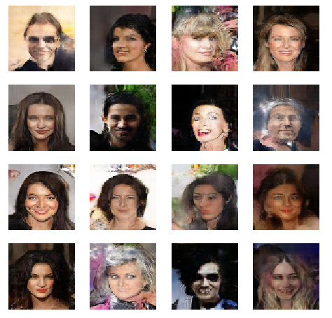

# DCGAN-tensorflow

This is a simple DCGAN implementation of https://arxiv.org/pdf/1511.06434.pdf for generating new unseen images within the same domain as the dataset (in 64x64 resolution).
The model was trained for 10 epochs using a celeb-hq dataset containing 200k face examples, which means that model was feeded with 2mln examples. In practice it was giving satisfactory results even with dataset containing 5k celeb images, but generated images was noticeably lower quality (model was starting to overfit after several epochs)

## Results

### 64x64 images

Generated images as a gif for 16 fixed noises, through the 10 epochs of training.

Samples for last (10th) epoch:

Discriminator and generator losses:

### 128x128 images

I also tried with higher resolutions, by simply adding additional convolutional layer with strides = 2 to the generator and discriminator. 

For 128x128 training took much more computation and memory resources (about x4 longer training than 64x64) - Training last a few hours with one 3060ti.

Samples for last (65th) epoch

### 256x256 images

For 256x256 training took about 12h (about x16 longer training than 64x64)

## Training tricks and tips applied in this implementation

* The generator is updated more frequently to avoid the fast convergence of the discriminator.
* Label smoothing is applied to the labels.
* Inputs/outputs normalization to the range [-1, 1] and tanh activation in the generator output.
* GaussianNoise as the regularization method in the discriminator.
* LeakyReLU in the discriminator and relu in the generator.
* The larger resolution the larger dataset is needed. For example for 64x64 resolution 1000 examples gives weak results, 5k gives satisfactory results. When using more than 30k I couldn't see any overfitting and further increasing the dataset probably will not help.
